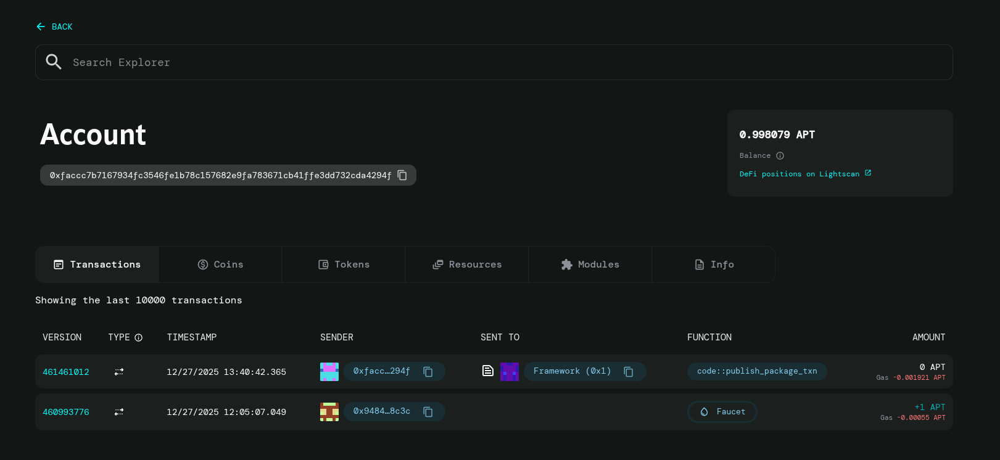

# Hello Blockchain - Aptos Buildathon Project

A simple message storage smart contract built on Aptos blockchain, demonstrating fundamental Move programming concepts and deployed on Aptos Devnet.

## 📋 Overview

This project was created as part of the Aptos Buildathon and showcases a basic smart contract that allows users to store and update string messages on the blockchain. The contract uses Move's resource-oriented programming model to manage data storage securely.

## 🚀 Deployed Contract

- **Contract Address**: `0xfaccc7b7167934fc3546fe1b78c157682e9fa783671cb41ffe3dd732cda4294f`
- **Network**: Aptos Devnet
- **Explorer**: [View on Aptos Explorer](https://explorer.aptoslabs.com/account/0xfaccc7b7167934fc3546fe1b78c157682e9fa783671cb41ffe3dd732cda4294f?network=devnet)



## 🎯 Features

- **Message Storage**: Store custom string messages on-chain
- **Message Updates**: Update existing messages seamlessly
- **Resource Management**: Utilizes Move's resource model with the `MessageHolder` struct
- **Entry Functions**: Public entry function for easy interaction

## 📝 Smart Contract Details

### Module: `hello_blockchain::hello_blockchain`

#### Resources

```move
struct MessageHolder has key {
    message: string::String,
}
```

The `MessageHolder` resource stores a single string message and is associated with each user's account.

#### Public Functions

##### `set_message`
```move
public entry fun set_message(account: &signer, msg_bytes: vector<u8>)
```

**Description**: Sets or updates a message for the caller's account.

**Parameters**:
- `account`: Signer reference (the account calling the function)
- `msg_bytes`: UTF-8 encoded bytes of the message to store

**Behavior**:
- If the account doesn't have a `MessageHolder` resource, it creates one with the provided message
- If a `MessageHolder` already exists, it updates the message to the new value

## 🛠️ Technology Stack

- **Language**: Move
- **Blockchain**: Aptos
- **Framework**: Aptos Framework
- **Network**: Devnet

## 📦 Project Structure

```
aptos_proj/
├── Move.toml              # Package manifest
├── sources/
│   └── hello.move         # Main smart contract
└── Readme.md             # This file
```

## 🔧 Setup & Deployment

### Prerequisites

- [Aptos CLI](https://aptos.dev/tools/aptos-cli-tool/install-aptos-cli) installed
- Aptos wallet with devnet funds

### Compilation

```bash
aptos move compile
```

### Testing

```bash
aptos move test
```

### Deployment

```bash
aptos move publish --named-addresses hello_blockchain=<YOUR_ADDRESS>
```

## 💡 How to Use

### Setting a Message

Use the Aptos CLI to interact with the deployed contract:

```bash
aptos move run \
  --function-id '0xfaccc7b7167934fc3546fe1b78c157682e9fa783671cb41ffe3dd732cda4294f::hello_blockchain::set_message' \
  --args 'string:Hello, Aptos!'
```

Or use the Aptos SDK in your application to call the `set_message` function.

## 🎓 Key Learnings

This project demonstrates:

1. **Move Resource Model**: Understanding how resources work with the `key` ability
2. **Entry Functions**: Creating public entry points for blockchain interactions
3. **Signer Pattern**: Properly handling account authentication
4. **Conditional Logic**: Checking resource existence and conditional resource creation
5. **String Handling**: Converting byte vectors to strings in Move

## 🌟 Aptos Buildathon

This project was built as part of the Aptos Buildathon to learn and explore the Aptos blockchain ecosystem and Move programming language.

## 📄 License

This project is open source and available for educational purposes.

## 🔗 Resources

- [Aptos Documentation](https://aptos.dev/)
- [Move Language Guide](https://move-language.github.io/move/)
- [Aptos Developer Tutorials](https://aptos.dev/tutorials/)

## 👤 Author

Built with ❤️ during the Aptos Buildathon by Devkhishan S
